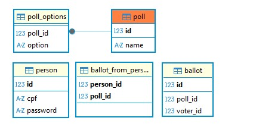

# votingMS – Sistema de Votação em Microsserviços

votingMS é um sistema de votação distribuído com 5 microsserviços + biblioteca compartilhada. Ele demonstra mensageria assíncrona com RabbitMQ, comunicacao síncrona com OpenFeign, descoberta de serviços via Eureka, configuração centralizada com Spring Cloud Config e persistência em PostgreSQL. Esse projeto foi muito importante para o meu aprendizado, pois melhorou muito meu conhecimento no trabalho com JWT puro e tratamento de exceções entre microsserviços, seja em cenários sícronos ou assícronos.

## 📦 Tecnologias Utilizadas

- ✅ Spring Boot
- 🔐 Jsonwebtoken (JWT puro) + Spring security crypto
- ✉️ RabbitMQ
- ☁️ Spring Cloud Config
- 🎯 Eureka Discovery Server
- 📡 Open Feign
- 🗃️ JPA / Hibernate
- 🔄 ModelMapper
- 🐘 PostgreSQL
- 📦 Maven

---

## 🏗 Arquitetura

## O projeto é dividido em quatro microsserviços principais:

### 1. PollRepositoryService — Gerencia a criação e armazenamento de votações, votos e pessoas.

### 2. PollManagerService — Cria novas votações.

### 3. PollVotingService — Cria novos votos.

### 4. PollCorrectionService — Corrige determinada votação pelo id

#### (ConfigService(Servidor de configuração centralizada) + EurekaService(Servidor de registro de serviços) + shared-library(Trata-se daquilo que é utilizado por mais de um serviço))
#### Comunicação assíncrona entre serviços é realizada via RabbitMQ, .

---

## 🧠 Ordem lógica da aplicação

- É criado uma votação no ManagerService, logo enviando tal objeto via serviço de mensageria para RepositoryService, sendo salvo.
- Ao criar agora um usuário (cpf, senha) no VotingService, vai ser enviado tal objeto síncronamente para RepositoryService, cujo qual vai ver se o cpf ja é existente, caso tudo ocorra bem, salvará a senha criptografada no banco e retornará um token. (O mesmo deve ser salvo, justo que apenas com ele podemos votar). 
- Com o usuário criado e uma votação, vamos votar. Para isso, precisamos apenas do Id da votação. Assim sendo, seguimos enviando assíncronamente um objeto(pollId, option, token) para RepositoryService, cujo qual tem todo um sistema de verificação para saber se esse voto pode ser validado(tal como, token é valido? Usuário ja deu voto nessa votação? Tal votação existe? Tal opção é valida, e etc). Correndo tudo certo, vai ser retornado um objeto de confirmação de voto(pollId, option, cpf).
- Para corrigir determinada votação, basta escolher de acordo com o Id aquela que voce deseja resolver, retornando um objeto de resolvimento.

---

